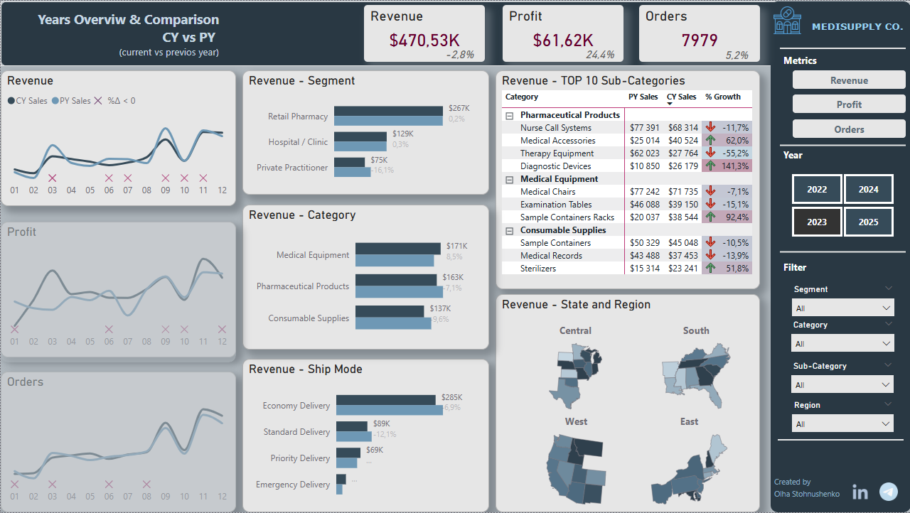

# 📊 MediSupply Co. — End of Year Sales Dashboard

> **Power BI | Year-over-Year Performance Overview | Medical Supply Industry**

---

## 🧭 Project Overview

This Power BI dashboard delivers a comprehensive **end-of-year sales analysis** for a medical supply company, enabling leadership to assess performance across segments, product categories, delivery modes, and geographic regions — all in a single, coherent view.

The report compares **Current Year (CY) vs Previous Year (PY)** across three core KPIs: Revenue, Profit, and Orders, with month-level granularity and dynamic filtering.

---

## ✨ Key Features

- **KPI Summary Cards** — Top-level metrics (Revenue: $470.5K | Profit: $61.6K | Orders: 7,979) paired with YoY delta indicators and sparkline trend lines for immediate context
- **Monthly Trend Lines** — CY vs PY line charts for Revenue, Profit, and Orders with negative delta markers highlighted in red
- **Revenue by Segment** — Horizontal bar chart comparing Retail Pharmacy, Hospital/Clinic, and Private Practitioner with YoY % change
- **Revenue by Category** — Side-by-side comparison across Medical Equipment, Pharmaceutical Products, and Consumable Supplies
- **Revenue by Ship Mode** — Breakdown across Economy, Standard, Priority, and Emergency Delivery channels
- **TOP 10 Sub-Categories Table** — Ranked performance with PY Sales, CY Sales, and color-coded % Growth arrows
- **Regional Map View** — Four-region US breakdown (Central, South, West, East) with heat-map shading
- **Interactive Filters Panel** — Slicers for Year (2022–2025), Segment, Category, Sub-Category, and Region

---

## 💡 What Makes This Dashboard Stand Out

**Strong KPI column design** — Combines overall totals with monthly sparklines so year-over-year context is visible at a glance, without needing to drill into detail pages.

**Clear segment, category, and ship-mode comparisons** — Each chart surfaces where growth is accelerating and where decline is happening, making it easy to ask the right follow-up questions.

**Well-structured regional overview** — Four-region breakdown separates geographic performance without overwhelming the viewer with information density.

**Radial sub-category breakdown** — Adds visual variety while keeping category comparisons intuitive and scannable.

**Consistent design language** — Every card, chart, and filter follows the same dark navy + steel blue palette, typography scale, and layout logic — making the dashboard feel cohesive and executive-ready.

---

## 🛠 Tools & Tech

| Tool | Purpose |
|------|---------|
| **Power BI Desktop** | Report development & data modeling |
| **DAX** | KPI measures, YoY delta calculations, dynamic titles |
| **Power Query (M)** | Data transformation & cleaning |
| **Custom Visuals** | Map chart, sparklines |

---

## 🚀 How to Run
**Open in Power BI Desktop**
   - Open [MediSupply Dashboard]((https://github.com/OlhaStoh/medisupply-dashboard))

 **Explore the dashboard**
   - Use the **Year** buttons (2022–2025) to switch between periods
   - Apply **Segment / Category / Region** filters on the right panel

---

## 📸 Preview

| Section | Description |
|---------|-------------|
| Top KPIs | Revenue, Profit, Orders with YoY delta |
| Trend Charts | Monthly CY vs PY comparison |
| Sub-Category Table | TOP 10 ranked by CY Sales with growth indicators |
| Regional Map | US 4-region heatmap |

---

